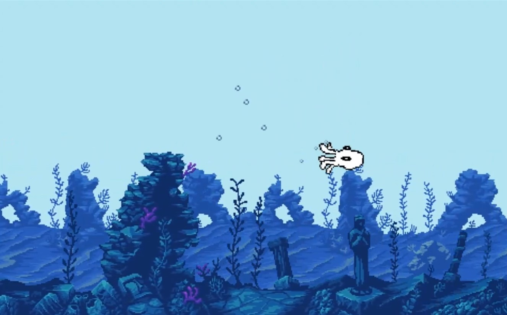

# Octopus Game

Meet Generic Octopus. Unlike his daddy octopus and his granddaddy octopus who were quite content living in the dull blue of the coastal seas and befriending wise old turtles, this teenage octopus has Grand Dreams (as only teenagers seem to have). So he has set out on a life-changing journey to swim into the deep sea and discover new creatures.

# How to play?

Game is live at [nirav.com.np/Octopus-Game-JS](https://nirav.com.np/Octopus-Game-JS).

# How to play locally?

Clone the repository with `git clone https://github.com/niravcodes/Octopus-Game-JS` and cd into the folder.
Then open the file at `dist/index.html` in a browser.

# How'd you make it?

Check out **[the corresponding blog post](https://nirav.com.np/2020/09/14/octopus-game.html)** on my [blog](https://nirav.com.np/).

# How to modify the game?

The engine code is in folder `/library`, and the game code is in `/testGame`. Once you've modified the code, run `./build.sh` to
transpile the game, and test it by opening the file `dist/index.html`.

# What License?

**All published code in this repository is _MIT Licensed_**. MIT license allows you to do what you want
with my code, as long as you maintain the copyright notice. Read LICENSE.md for details.

The artwork and animation for the Octopus character is copyrighted, meaning it's mine, don't touch it (I'd like to use
it for some other project later).

# Other works used

The background art was done by Ansimuz [ansimuz.itch.io](https://ansimuz.itch.io/). His work is awesome.

The octopus icon in Title UI made by [Freepik](http://www.freepik.com/) from [www.flaticon.com](https://www.flaticon.com/).

Uses Babel and Browserify to convert ES6 JavaScript to
ES5 JavaScript. Uses Google Closure Compiler to minify.
